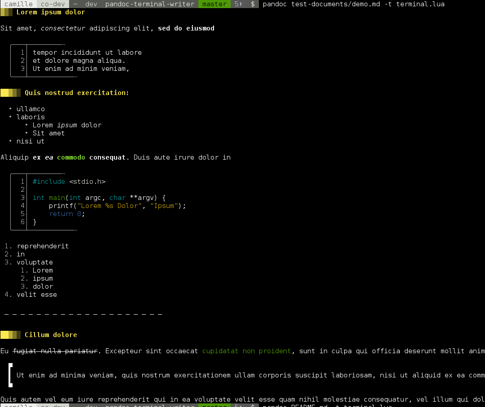

# Pandoc Terminal Writer -- Pretty-print text documents on a terminal

## Presentation

This is a [custom writer](https://pandoc.org/lua-filters.html) (output driver)
for **pandoc** written in lua. When chosen as output format, it will
pretty-print the input document on the terminal. It makes heavy use of VT100
control sequences and Unicode box-drawing characters.

As Pandoc supports many input formats:

> (several dialects of) Markdown, reStructuredText, textile, HTML, DocBook,
> LaTeX, MediaWiki markup, TWiki markup, TikiWiki markup, Creole 1.0, Vimwiki
> markup, OPML, Emacs Org-Mode, Emacs Muse, txt2tags, Microsoft Word docx,
> LibreOffice ODT, EPUB, or Haddock markup 

this writer is suitable for displaying any document in any of these input
formats.

## Usage

You need to have [pandoc installed](https://pandoc.org/installing.html) on your machine,
and the **terminal.lua** script from this repository copied somewhere on your machine.

Then invoke the reader with

```bash
$ pandoc -t [path/to/]terminal.lua [the_document]

# e.g.:

$ pandoc -t terminal.lua README.md 
```

As word wrapping is not yet supported, you may want to pipe the output into the
`fold` command. You may also want to use a _pager_ such as `less`:

```bash
$ pandoc -t terminal.lua README.md | fold -s | less -r
```

Note that currently the word wrapping as implemented by `fold` will break the
indentation and the code and quote blocks decorations. This is an issue we want
to address inside the writer in the near future.

## Demo

A screenshot is worth 1000 words:

This document :


Another Markdown document :



A LibreOffice text document


## Author

Camille Oudot (© 2018 Orange)

## Licence

This work is published under the MIT license
